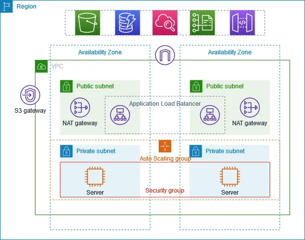

# Smart_Aws_Infra

## Description 
The Smart_Aws_Infra project provides a comprehensive solution for deploying a monitoring stack on a Kubernetes cluster using Prometheus and Grafana. This setup enables robust monitoring and visualization of your Kubernetes infrastructure, ensuring you can track performance metrics, set up alerts, and gain insights into the health and status of your applications and services. The deployment process leverages Helm charts to simplify the installation and management of Prometheus and Grafana, making it easier to maintain and scale your monitoring infrastructure.

## Architecture 


## Prerequisites

- Kubernetes cluster
- kubectl configured
- Helm installed

## Steps

1. **Add Helm Repositories**
    ```sh
    helm repo add prometheus-community https://prometheus-community.github.io/helm-charts
    helm repo add grafana https://grafana.github.io/helm-charts
    helm repo update
    ```

2. **Create Monitoring Namespace**
    ```sh
    kubectl create namespace monitoring
    ```

3. **Install Prometheus**
    ```sh
    helm install prometheus prometheus-community/prometheus --namespace monitoring
    ```

4. **Install Grafana**
    ```sh
    helm install grafana grafana/grafana --namespace monitoring
    ```

5. **Access Grafana**
    - Get the Grafana admin password:
      ```sh
      kubectl get secret --namespace monitoring grafana -o jsonpath="{.data.admin-password}" | base64 --decode ; echo
      ```
    - Port forward to access Grafana UI:
      ```sh
      kubectl port-forward --namespace monitoring svc/grafana 3000:80
      ```
    - Open your browser and go to `http://localhost:3000`, login with `admin` and the password retrieved above.
Reference this 
 https://medium.com/@akilblanchard09/monitoring-a-kubernetes-cluster-using-prometheus-and-grafana-8e0f21805ea9

 ## Note 
**Note:** It doesn't automatically attach to the StorageClass, so you have to edit the respective PV and the default storage class and add `gp2`.