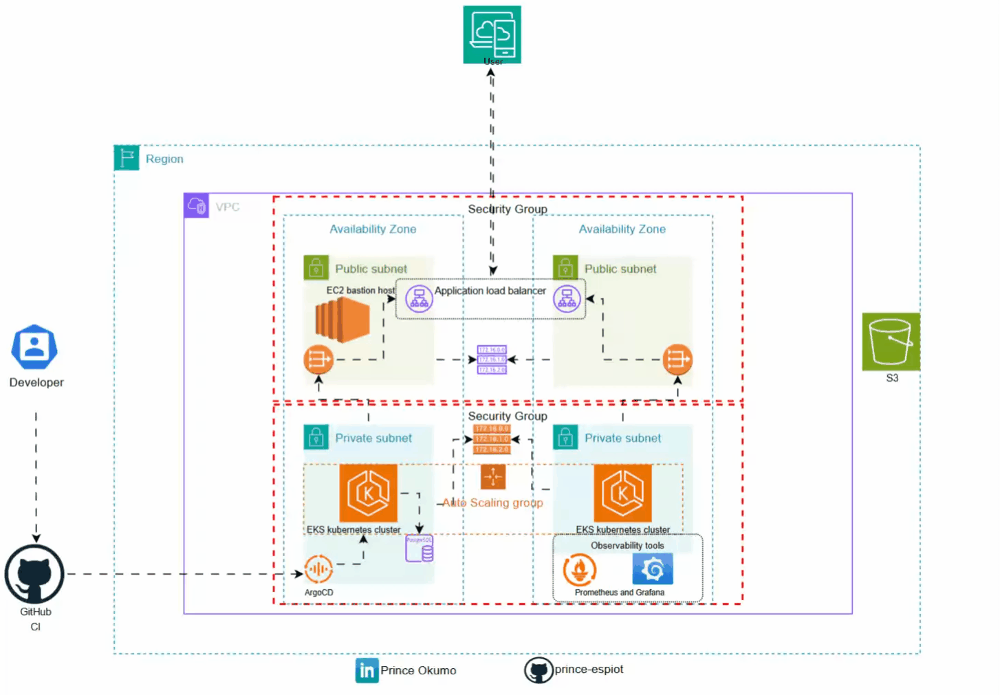

# Smart Aws Infrastructure

## Description 
The Smart_Aws_Infra project offers a robust and integrated solution for deploying, monitoring, and managing Kubernetes clusters using GitOps principles. This infrastructure setup comes pre-configured with essential tools for seamless deployment, comprehensive monitoring, and efficient GitOps workflows. By leveraging AWS services and popular open-source tools, Smart_Aws_Infra ensures a scalable, reliable, and automated environment for your Kubernetes applications.


<div align="center">

## AWS Services and Tools

| AWS Services | Tools Included |
|--------------|----------------|
| EKS          | Prometheus     |
| EC2          | Grafana        |
| VPC          | ArgoCD         |
| ACM          | Helm           |
| Route53      |                |
| S3           |                |
| ALB          |                |
</div>


## Architecture
<p align="center">
  <div align="center">
    
    <p><strong>Figure 1:</strong> Architecture Diagram of Smart AWS Infrastructure</p>
  </div>
</p>

## Steps
### Before Provisioning
The infrastructure is divided into ten modules within the `./main.tf` file. To ensure a smooth setup process, apply the first six modules initially before adding and applying the remaining four modules.

### Infrastructure Provision 
1. **Configure Terraform Variables**
  - Edit the `terraform.tfvars` file with custom parameters as needed.

2. **Initialize Terraform**
  - Run the following command to initialize the Terraform configuration:
    ```sh
    terraform init
    ```

3. **Plan the Infrastructure**
  - Generate and review the execution plan for the infrastructure:
    ```sh
    terraform plan
    ```

4. **Apply the Configuration**
  - Apply the Terraform configuration to provision the infrastructure:
    ```sh
    terraform apply -auto-approve
    ```

5. **Access the Bastion Host**
  - After the infrastructure is provisioned, use the output parameters to log in to your bastion host via ssh.

### AWS CLI Configuration
6. **Configure AWS CLI**
  - Run the following command to configure your AWS CLI with your access key and secret access key:
    ```sh
    aws configure
    ```

### Update Kubeconfig for EKS Cluster
7. **Update Kubeconfig**
  - Run the following command to update your kubeconfig file with the EKS cluster details:
    ```sh
    aws eks update-kubeconfig --name <name-of-cluster> --region <region>
    ```

 
 
 ## Note 
**Note:** The PersistentVolume (PV) does not automatically attach to the StorageClass. You need to manually edit the PV and set the default StorageClass to `gp2`. To patch the StorageClass, run the following command:
```sh
kubectl patch storageclass gp2 -p '{"metadata": {"annotations":{"storageclass.kubernetes.io/is-default-class":"true"}}}'
```


 ## Manual step

### Generating SSH Keys
1. **Generate SSH Key Pair**
  - Run the following command to generate a new SSH key pair:
    ```sh
    ssh-keygen -t rsa -b 4096 -C "your_email@example.com"
    ```
  - Follow the prompts to save the key pair to the default location (`~/.ssh/id_rsa`) and set a passphrase if desired.

2. **Add SSH Key to SSH Agent**
  - Start the SSH agent in the background:
    ```sh
    eval "$(ssh-agent -s)"
    ```
  - Add your SSH private key to the SSH agent:
    ```sh
    ssh-add ~/.ssh/id_rsa
    ```

3. **Add SSH Key to GitHub**
  - Copy the SSH public key to your clipboard:
    ```sh
    cat ~/.ssh/id_rsa.pub
    ```
  - Log in to your GitHub account, navigate to **Settings > SSH and GPG keys**, and click **New SSH key**. Paste the SSH public key and save.

4. **Test SSH Connection**
  - Test the SSH connection to GitHub:
    ```sh
    ssh -T git@github.com
    ```
  
### ArgoCD setup
1. **Create ArgoCD Namespace**
  - Run the following command to create the `argocd` namespace (if it doesn't already exist):
    ```sh
    kubectl create namespace argocd || echo "Namespace argocd already exists"
    ```

2. **Install ArgoCD**
  - Apply the ArgoCD installation manifest to the `argocd` namespace:
    ```sh
    kubectl apply -n argocd -f https://raw.githubusercontent.com/argoproj/argo-cd/stable/manifests/install.yaml
    ```
  - You should see a success message indicating that you have successfully authenticated.
Retrieving the initial single sign-on password for the ArgoCD UI: 
```sh
kubectl -n argocd get secret argocd-initial-admin-secret -o jsonpath="{.data.password}" | base64 -d; echo
```

## Note
**Note:** This step is required only if you enable the observability module in `main.tf`.  
1. **Access ArgoCD**
  - Access the ArgoCD UI using the Load Balancer URL and the initial password.

2. **Login to ArgoCD**
  - Use the default username `admin` and the password retrieved in the previous step to log in to ArgoCD.

3. **Add Kubernetes Cluster**
  - Add the EKS cluster by providing the kubeconfig file and the cluster name.

4. **Add Application**
  - Add the application by providing the repository URL and the path to the manifests directory.

5. **Sync the Application**
  - Sync the application to deploy the resources on the Kubernetes cluster.

### Prometheus and Grafana Setup
1. **Access Grafana**
  - Access the Grafana UI using the Load Balancer URL and the default credentials.

2. **Add Prometheus Datasource**
  - Add the Prometheus datasource to Grafana using the Prometheus Load Balancer URL.

3. **Import Dashboards**
  - Import the pre-configured dashboards for monitoring Kubernetes and EKS clusters.

4. **Configure Alerts**
  - Configure alerting rules in Prometheus and Grafana to receive notifications for critical events.

### Helm Setup
1. **Install Helm**
  - Install Helm on your local machine to manage Kubernetes applications using Helm charts.

2. **Add Helm Repository**
  - Add the Helm repository URL to access the Helm charts for deploying applications.

3. **Install Application**
  - Install applications on the Kubernetes cluster using Helm charts and the Helm CLI.


### Alternative Setup Using Helm

If you prefer a simpler setup, you can use the community stack to streamline the process.

#### Pre-requisite: Install Helm

#### Step 1: Add Helm Repositories
Add the following Helm repositories:
```sh
helm repo add prometheus-community https://prometheus-community.github.io/helm-charts
helm repo add stable https://charts.helm.sh/stable
```

#### Step 2: Update Helm Repositories
Update the Helm repositories:
```sh
helm repo update
```

#### Step 3: Install Prometheus Kubernetes
Install the Prometheus Kubernetes stack:
```sh
helm install prometheus prometheus-community/kube-prometheus-stack --namespace monitoring --create-namespace
```

#### Step 4: Port Forward Prometheus Grafana
Set up port forwarding to access Grafana:
```sh
kubectl port-forward deployment/prometheus-grafana 3000
```

#### Step 5: Log in to Grafana
Open your browser and navigate to `http://localhost:3000`. Use the default credentials to log in:
- **Username:** admin
- **Password:** prom-operator

You can create new users and update passwords after logging in.
### Clean-Up
1. **Destroy Infrastructure**
  - Run the following command to destroy the provisioned infrastructure:
    ```sh
    terraform destroy -auto-approve
    ```
2. **Delete EKS Cluster**
  - Delete the EKS cluster using the AWS Management Console or the AWS CLI.

3. **Delete ArgoCD Application**
  - Delete the application from ArgoCD before destroying the infrastructure.

4. **Delete Prometheus and Grafana**
  - Delete the Prometheus and Grafana resources from the Kubernetes cluster.

5. **Delete Helm Releases**
  - Uninstall the Helm releases to remove the deployed applications from the cluster.

6. **Delete Route53 Records**
  - Delete the Route53 records associated with the infrastructurekubectl -n argocd get secret argocd-initial-admin-secret \
      -o jsonpath="{.data.password}" | base64 -d; echo
