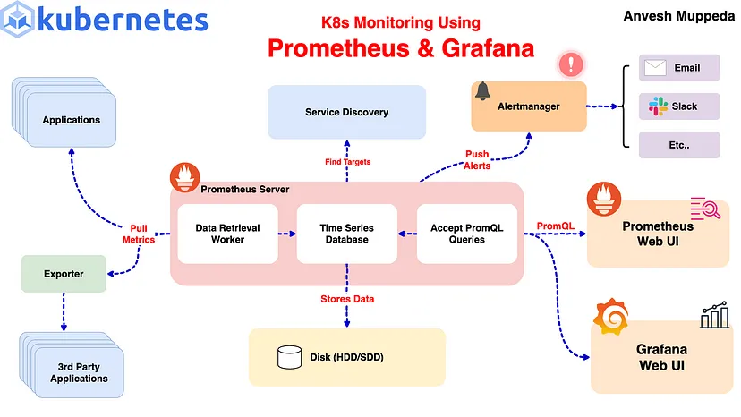
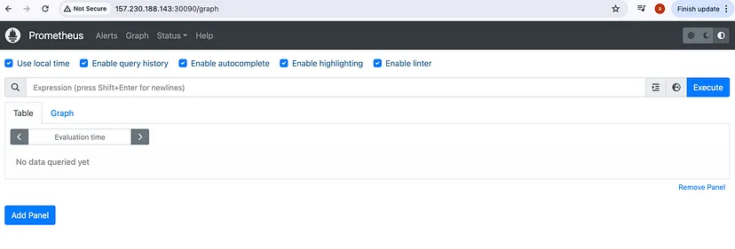
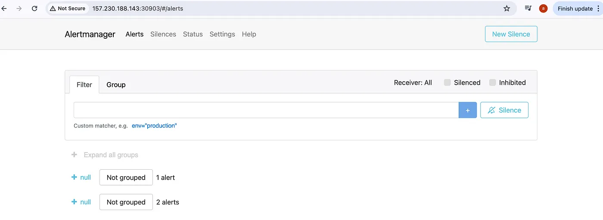
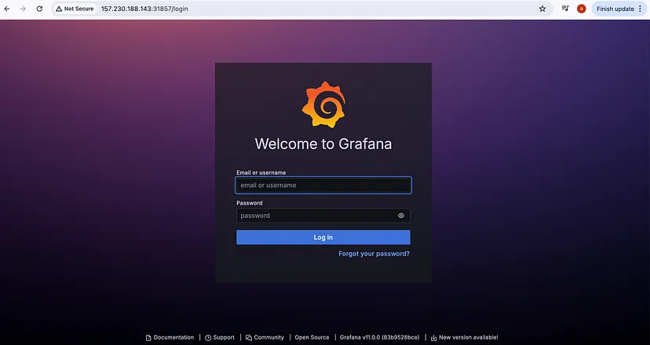
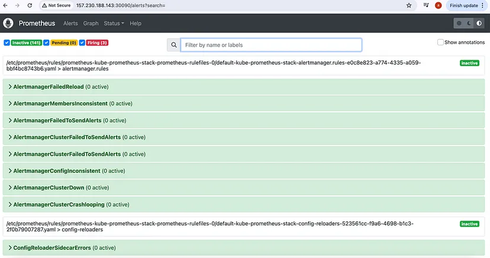
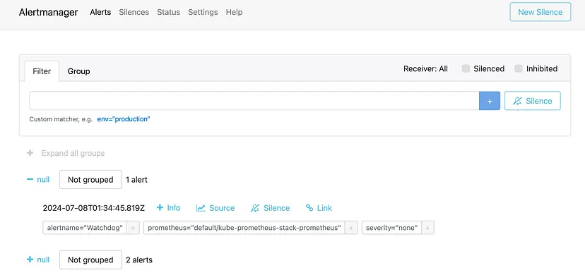
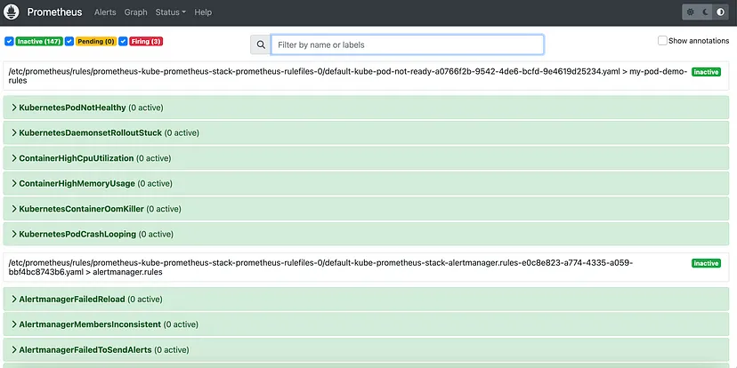

# ⎈ A Hands-On Guide: Setting Up Prometheus and AlertManager in Kubernetes with Custom Alerts 🛠️



Monitoring your Kubernetes cluster is crucial for maintaining the health and performance of your applications. This guide walks you through setting up Prometheus and Alertmanager using Helm and configuring custom alert rules to monitor your cluster effectively.

---

## Step 1: Install Prometheus and Alertmanager Using Helm

We’ll use the `kube-prometheus-stack` Helm chart from the Prometheus community. This chart includes Prometheus, Alertmanager, and Grafana, along with several pre-configured dashboards and alerting rules.

### Create Custom Configuration

To customize the setup, create a `custom-values.yaml` file with the following content:

```yaml
# custom-values.yaml
prometheus:
  service:
    type: NodePort
grafana:
  service:
    type: NodePort
alertmanager:
  service:
    type: NodePort
```
Next, install the kube-prometheus-stack using Helm:

helm upgrade --install kube-prometheus-stack prometheus-community/kube-prometheus-stack -f custom-values.yaml
This command will deploy Prometheus, Alertmanager, and Grafana to your cluster with the services exposed as NodePort.

Step 2: Verifying the Setup
To verify that Prometheus and Alertmanager are running correctly, you can access their web UIs. Since we exposed their services as NodePort, you can use kubectl port-forward to access them locally or you can use external IP of the cluster and nodeport of the respective service.
For Prometheus:


Prometheus UI
For Alertmanager:


AlertManager UI
For Grafana:

```yaml
username: admin     
Password: prom-operator
```

Grafana Dashboard
Access the default Alertmanager rules:

To access the alertmanager rules/alerts, navigate to Alerts section on prometheus UI:


Alerts in Prometheus UI
Here we can see that three alerts are in Firing state, so these alerts we can see in AlertManager UI to manage:


Step 3: Configuring Custom Alert Rules
From the above steps we can see that the default alerts are configured in prometheus and alertmanager. Now, let’s add custom alert rules to monitor our Kubernetes cluster. We’ll create a PrometheusRule manifest to define these alerts.

Create a file named custom-alert-rules.yaml with the following content:
```yaml
apiVersion: monitoring.coreos.com/v1
kind: PrometheusRule
metadata:
  labels:
    app: kube-prometheus-stack
    app.kubernetes.io/instance: kube-prometheus-stack
    release: kube-prometheus-stack
  name: kube-pod-not-ready
spec:
  groups:
  - name: my-pod-demo-rules
    rules:
    - alert: KubernetesPodNotHealthy
      expr: sum by (namespace, pod) (kube_pod_status_phase{phase=~"Pending|Unknown|Failed"}) > 0
      for: 1m
      labels:
        severity: critical
      annotations:
        summary: Kubernetes Pod not healthy (instance {{ $labels.instance }})
        description: "Pod {{ $labels.namespace }}/{{ $labels.pod }} has been in a non-running state for longer than 15 minutes.\n  VALUE = {{ $value }}\n  LABELS = {{ $labels }}"      
    - alert: KubernetesDaemonsetRolloutStuck
      expr: kube_daemonset_status_number_ready / kube_daemonset_status_desired_number_scheduled * 100 < 100 or kube_daemonset_status_desired_number_scheduled - kube_daemonset_status_current_number_scheduled > 0
      for: 10m
      labels:
        severity: warning
      annotations:
        summary: Kubernetes DaemonSet rollout stuck (instance {{ $labels.instance }})
        description: "Some Pods of DaemonSet {{ $labels.namespace }}/{{ $labels.daemonset }} are not scheduled or not ready\n  VALUE = {{ $value }}\n  LABELS = {{ $labels }}"
    - alert: ContainerHighCpuUtilization
      expr: (sum(rate(container_cpu_usage_seconds_total{container!=""}[5m])) by (pod, container) / sum(container_spec_cpu_quota{container!=""}/container_spec_cpu_period{container!=""}) by (pod, container) * 100) > 80
      for: 2m
      labels:
        severity: warning
      annotations:
        summary: Container High CPU utilization (instance {{ $labels.instance }})
        description: "Container CPU utilization is above 80%\n  VALUE = {{ $value }}\n  LABELS = {{ $labels }}"
    - alert: ContainerHighMemoryUsage
      expr: (sum(container_memory_working_set_bytes{name!=""}) BY (instance, name) / sum(container_spec_memory_limit_bytes > 0) BY (instance, name) * 100) > 80
      for: 2m
      labels:
        severity: warning
      annotations:
        summary: Container High Memory usage (instance {{ $labels.instance }})
        description: "Container Memory usage is above 80%\n  VALUE = {{ $value }}\n  LABELS = {{ $labels }}"
    - alert: KubernetesContainerOomKiller
      expr: (kube_pod_container_status_restarts_total - kube_pod_container_status_restarts_total offset 10m >= 1) and ignoring (reason) min_over_time(kube_pod_container_status_last_terminated_reason{reason="OOMKilled"}[10m]) == 1
      for: 0m
      labels:
        severity: warning
      annotations:
        summary: Kubernetes Container oom killer (instance {{ $labels.instance }})
        description: "Container {{ $labels.container }} in pod {{ $labels.namespace }}/{{ $labels.pod }} has been OOMKilled {{ $value }} times in the last 10 minutes.\n  VALUE = {{ $value }}\n  LABELS = {{ $labels }}"
    - alert: KubernetesPodCrashLooping
      expr: increase(kube_pod_container_status_restarts_total[1m]) > 3
      for: 2m
      labels:
        severity: warning
      annotations:
        summary: Kubernetes pod crash looping (instance {{ $labels.instance }})
        description: "Pod {{ $labels.namespace }}/{{ $labels.pod }} is crash looping\n  VALUE = {{ $value }}\n  LABELS = {{ $labels }}"
```
Apply the manifest to your Kubernetes cluster:

kubectl apply -f custom-alert-rules.yaml
Once the PromethuesRule is created then check the newly created alerts on Prometheus UI.

That’s it we have successfully added our new custom alerts on alertmanager.

helm uninstall kube-prometheus-stack